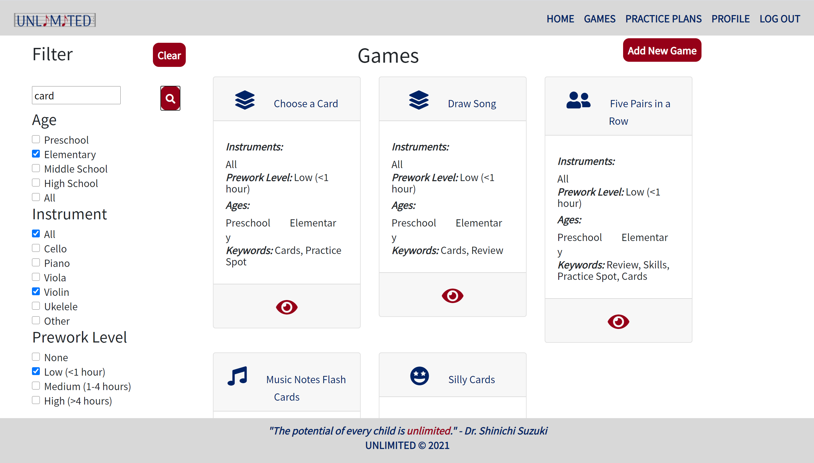

# Unlimited

## Description
"The potential of every child is unlimited," said Dr. Shinichi Suzuki, founder of the Suzuki music pedagogy. Their potential is, indeed, unlimited but not their attention span! Enter ***Unlimited***, the app that will help you keep young musicians engaged and consistent in their practices.

A full-stack CRUD application built with C#, ASP .NET Core MVC, SQL database, HTTP-based APIs, and a single-page React application with Firebase authentication and deployed with Azure, ***Unlimited*** is a one-stop shop where "practice partners" can create custom practice plans, browse games from the database, filter them based on their child's age and instrument, and track progress.

## Screenshots
### Games Page

## Tools & Technologies
API, ASP .NET Core MVC, Axios, Bootstrap, C#, CSS, E6 Modules, Firebase (for authentication), FreeLogoDesign, Github (for version control and project management), HTML5, JavaScript, Lucidchart, moqups, React, React Router, reactstrap, Saas, SQL, SSMS

## Features
1. Users can view a database of games that they can utilize to enhance music practices with their young students and their metadata. 
1. Users can filter the games by the age and instrument they are intended for and by the amount of prework required.
1. Users can acces a game details page, whre they see all the details of a game, including prework steps, instructions, and the source whom we can thank for each idea!
1. Users can register on the web site and log in to take advantage of
additional features.
1. Authenticated users can create practice plans and select specific games form the database for days included in the practice plan. 
1. Authenticated users can keep track of children's progress by marking mark games on practice plans as completed and keeping notes about how individual games worked for them.
1. Authenticated users can edit and delete practice plans.
1. Authenticated users can view their profile.
